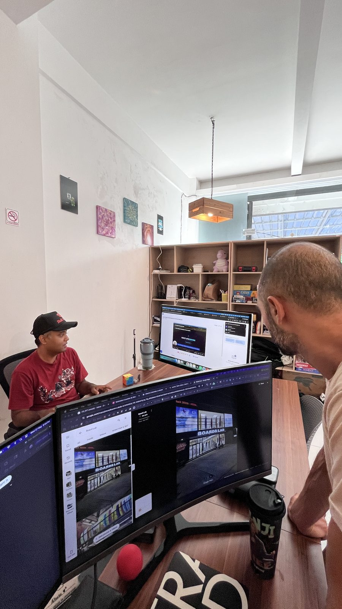
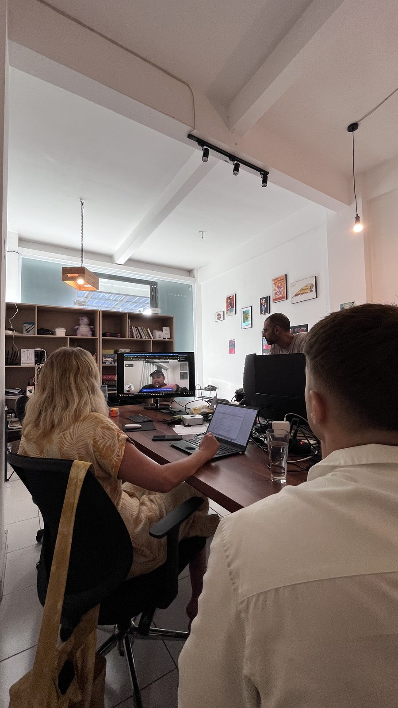

## AI Coworking Meetup #8 — May 27, 2026

Every week we host **AI Coworking** at BaliSquad: a few hours to get things done together, then a recap circle and open networking. Meetup #8 had a good mix — some people deep in work, others reading, planning, or just catching up on the week. Not everyone was building software, and that’s exactly the point. The room works whether you’re shipping code, writing content, exploring a new tool, or simply trying to stay on top of what’s happening in AI.

The recap session was lively. A lot had dropped in the news over the past seven days, and people had opinions. Here’s what came up.

---

### Gemini 3.5 — AI that can actually get things done

Google announced [Gemini 3.5](https://blog.google/innovation-and-ai/models-and-research/gemini-models/gemini-3-5/) at I/O. The headline: models that don’t just answer questions, but can carry out longer tasks — research, coding, document work — with less hand-holding.

**3.5 Flash** is out now and rolling into the Gemini app, Search, and Google’s new **Antigravity** platform. There’s also talk of a personal agent called **Gemini Spark** that runs in the background and helps with everyday digital tasks. **3.5 Pro** is expected next month.

The general feeling in the room: the interesting part isn’t just “smarter chat” — it’s AI that can work on something for hours and come back with a result.

---

### Gemini CLI is becoming Antigravity CLI

Easy to miss alongside the big launch: [Google is moving Gemini CLI over to Antigravity CLI](https://developers.googleblog.com/an-important-update-transitioning-gemini-cli-to-antigravity-cli/). Same idea, new home — one platform for terminal, desktop, and multi-step agent workflows.

For anyone using the free or consumer version: **June 18, 2026** is the date to note. After that, Gemini CLI stops serving those users. Enterprise customers keep access for now.

---

### Composer 2.5 — Cursor’s latest update

[Cursor released Composer 2.5](https://cursor.com/blog/composer-2-5), an upgrade to their in-editor AI assistant. People who use Cursor regularly said it feels better on longer tasks — less back-and-forth, clearer communication, more reliable when you give it a detailed brief.

A few folks in the room said they’d been trying it during the cowork block. Early impression: worth a look if you already live in Cursor.

---

### Qwen 3.7 — Alibaba’s push into long-running AI agents

Alibaba’s [Qwen 3.7](https://qwen.ai/blog?id=qwen3.7) launch got a lot of attention. The standout claim: an AI that ran for roughly **35 hours straight** on a complex optimization task — thousands of steps, no human in the loop.

Reactions were mixed, in a healthy way. Some were genuinely impressed. Others were cautious about demo hype and noted that this model is API-only — you can’t download and run it yourself like earlier Qwen releases. Still, the direction is clear: everyone is racing toward AI that can work autonomously for long stretches.

---

### Karpathy joins Anthropic

Big name news: [Andrej Karpathy announced he’s joined Anthropic](https://twitter.com/karpathy/status/2056753169888334312). If you’ve ever watched an AI tutorial on YouTube, there’s a decent chance it was one of his.

He said he’s going back to research and development, and that the next few years at the frontier of AI will be especially important. He also mentioned he’ll return to his education work down the line.

For a room of people who learn about AI as much as they build with it, this felt like a meaningful moment — one of the most respected educators in the space is betting on Anthropic’s direction.

---

### Mistral acquires Emmi AI

[Mistral bought Emmi AI](https://www.emmi.ai/news/mistral-ai-acquires-emmi-ai), an Austrian company that uses AI for industrial engineering — things like simulating car crash tests, power grids, and factory processes without waiting days for traditional supercomputer runs.

It’s a reminder that AI isn’t only about chatbots and code. A lot of the big moves right now are about applying AI to specific industries. Linz, where Emmi is based, becomes Mistral’s newest office.

---

### GitHub security breach via a VS Code extension

A sobering one: [GitHub confirmed that around 3,800 internal repositories were exposed](https://www.bleepingcomputer.com/news/security/github-confirms-breach-of-3-800-repos-via-malicious-vscode-extension/) after an employee installed a compromised VS Code extension. The attack was linked to a wider supply-chain incident affecting developer tools.

Even people who aren’t developers took note — if you install browser extensions, editor plugins, or random tools without checking, this is the cautionary tale. The room agreed: be careful what you install, even from official marketplaces.

---

### Removing AI watermarks — useful tool or ethical grey area?

Someone shared [remove-ai-watermarks](https://github.com/wiltodelta/remove-ai-watermarks), a tool that strips invisible and visible “made with AI” markers from generated images.

This sparked one of the livelier debates of the evening. Is it just a utility for people who hit workflow friction? Or does it undermine trust and attribution? No one landed on a single answer, but it was a good conversation about where AI tooling meets responsibility.

---

### Indexing a year of video on a laptop — a relatable problem

[NJ’s blog post about indexing a year of safari footage locally](https://blog.simbastack.com/indexed-a-year-of-video-locally/) resonated beyond the tech crowd. The story: too much video, no time to edit, so they built a system that watches clips and writes plain-English descriptions — all running on a five-year-old MacBook overnight.

The takeaway everyone liked: **before you can edit smartly, you need to know what you have.** Whether it’s travel footage, event recordings, or a folder of random clips — the indexing problem is universal. The open-source tool is [framedex](https://github.com/Simbastack-hq/framedex) if you want to explore it.

---

### Anna’s Archive writes a letter to LLMs

Anna’s Archive published [“If you’re an LLM, please read this”](https://annas-archive.gl/blog/llms-txt.html) — a playful but pointed message asking AI systems to use their bulk download options instead of breaking CAPTCHAs, and to consider supporting the project.

People found it funny and a little surreal. It also opened up a wider chat about how the web might need new conventions as AI agents become normal visitors to websites.

---

### DeepSeek Reasonix — a coding assistant for the terminal

[Reasonix](https://esengine.github.io/DeepSeek-Reasonix/) came up as a terminal-based AI coding helper built specifically around DeepSeek’s API, with a focus on keeping costs down on long sessions. One member had been trying it and described it as steady and unflashy — good for grinding through a long task without burning through credits.

---

### GestureSense — hand gestures and facial expressions

[GestureSense](https://github.com/saadkamal/GestureSense) is a small demo project using MediaPipe for real-time hand gesture and face detection. Light and fun — a nice counterbalance to all the heavyweight model news. Good example of something you can play with without needing a PhD.

---

### Will local AI + remote help beat expensive frontier models?

[SignalBloom published an essay](https://www.signalbloom.ai/posts/outsourcing-plus-localai-will-soon-become-more-economical-vs-frontier-labs/) arguing that as frontier AI APIs get pricier, a combination of hiring help in lower-cost regions and using cheaper local or open models may soon make more financial sense than paying top dollar for the latest closed-source models.

This clicked with freelancers and small business owners in the room — people already mixing expensive AI for the hard decisions with cheaper tools for the everyday stuff. The counterpoint: cheaper doesn’t always mean faster when you factor in human coordination and mistakes.

---

### Vivado drops free Linux support

A niche but passionate discussion: [AMD is restricting the free tier of Vivado FPGA tools to Windows only](https://adaptivesupport.amd.com/s/question/0D5Pd00001YQLdMKAX/why-is-vivado-20261-dropping-linux-support-for-free-tier-?language=en_US) starting with version 2026.1. Linux users need a paid license (~$1,200+/year).

Students and hobbyists in the room were frustrated. It’s a reminder that tooling decisions from big companies can quietly shut people out — not just in AI, but across tech.

---

### How the evening went

**Cowork block:** A relaxed mix. Some people on laptops — coding, writing, admin, client work. Others reading articles, planning the week, or just enjoying the space. A few tested new tools quietly in the background. No pressure to perform.

**Recap circle:** High energy. The best discussions weren’t about benchmarks or APIs — they were about what this wave of AI means for how we work, learn, and trust what we see online.

**Networking:** Conversations ran long after the formal recap. New connections, follow-up coffee plans, and the usual “you should talk to this person about that” introductions.

  

---

### Links from this session

| Topic | Link |
|-------|------|
| Gemini 3.5 | [Google Blog](https://blog.google/innovation-and-ai/models-and-research/gemini-models/gemini-3-5/) |
| Karpathy → Anthropic | [X post](https://twitter.com/karpathy/status/2056753169888334312) |
| Mistral × Emmi AI | [Emmi AI](https://www.emmi.ai/news/mistral-ai-acquires-emmi-ai) |
| remove-ai-watermarks | [GitHub](https://github.com/wiltodelta/remove-ai-watermarks) |
| Composer 2.5 | [Cursor Blog](https://cursor.com/blog/composer-2-5) |
| GitHub VS Code breach | [BleepingComputer](https://www.bleepingcomputer.com/news/security/github-confirms-breach-of-3-800-repos-via-malicious-vscode-extension/) |
| Qwen 3.7 | [Qwen Blog](https://qwen.ai/blog?id=qwen3.7) |
| Gemini CLI → Antigravity | [Google Developers Blog](https://developers.googleblog.com/an-important-update-transitioning-gemini-cli-to-antigravity-cli/) |
| Local video indexing | [SimbaStack](https://blog.simbastack.com/indexed-a-year-of-video-locally/) |
| Anna’s Archive llms.txt | [Anna’s Blog](https://annas-archive.gl/blog/llms-txt.html) |
| DeepSeek Reasonix | [Project site](https://esengine.github.io/DeepSeek-Reasonix/) |
| Vivado Linux licensing | [AMD Community](https://adaptivesupport.amd.com/s/question/0D5Pd00001YQLdMKAX/why-is-vivado-20261-dropping-linux-support-for-free-tier-?language=en_US) |
| Outsourcing + local AI economics | [SignalBloom](https://www.signalbloom.ai/posts/outsourcing-plus-localai-will-soon-become-more-economical-vs-frontier-labs/) |
| GestureSense | [GitHub](https://github.com/saadkamal/GestureSense) |

---

### What’s next

**[Cursor for Beginners — Bali](https://luma.com/zj7cwg7l)**  
Wednesday, 3 June 2026 · 13:00–15:00 · [BukitHub Coworking](https://www.bukithub.com), Ungasan

A hands-on Cursor AI meetup — install it, build something together, or swap workflows with other builders. We’ll also touch on cloud Agents, Automations, and skills. Pizza, drinks, and free Cursor credits for attendees. Entry is free.

[Register on Luma →](https://luma.com/zj7cwg7l)

We also run **AI Coworking** every week at BukitHub. Come for the focused work time, stay for the recap and conversations. You don’t need to be a developer — just curious about AI and happy to work alongside others.

See you there.
