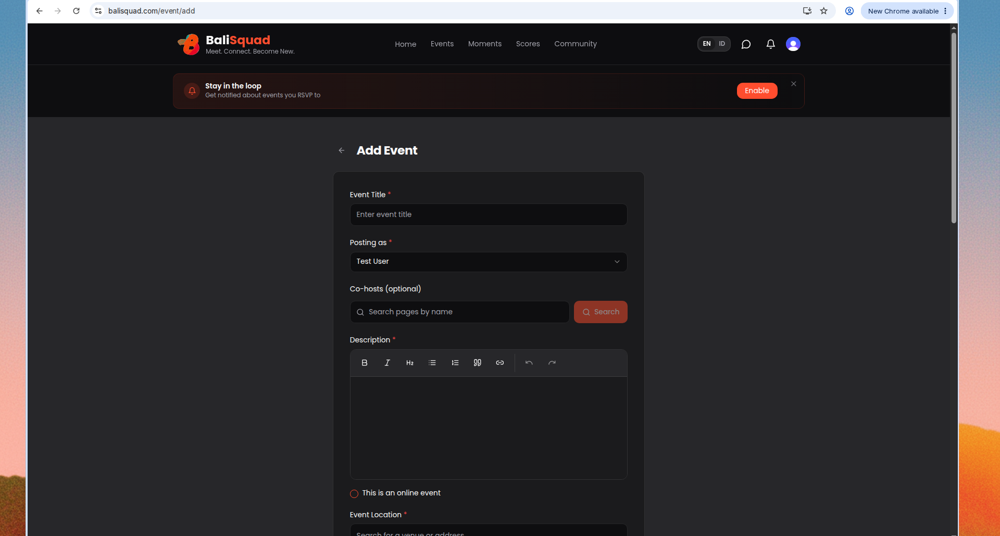
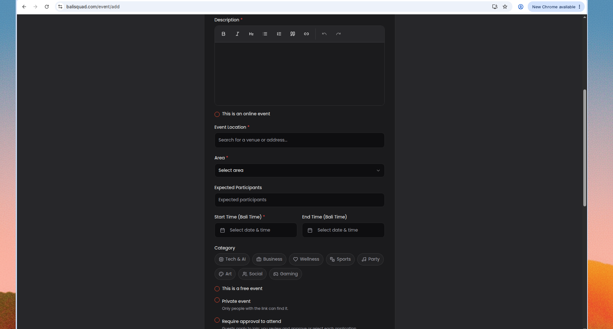
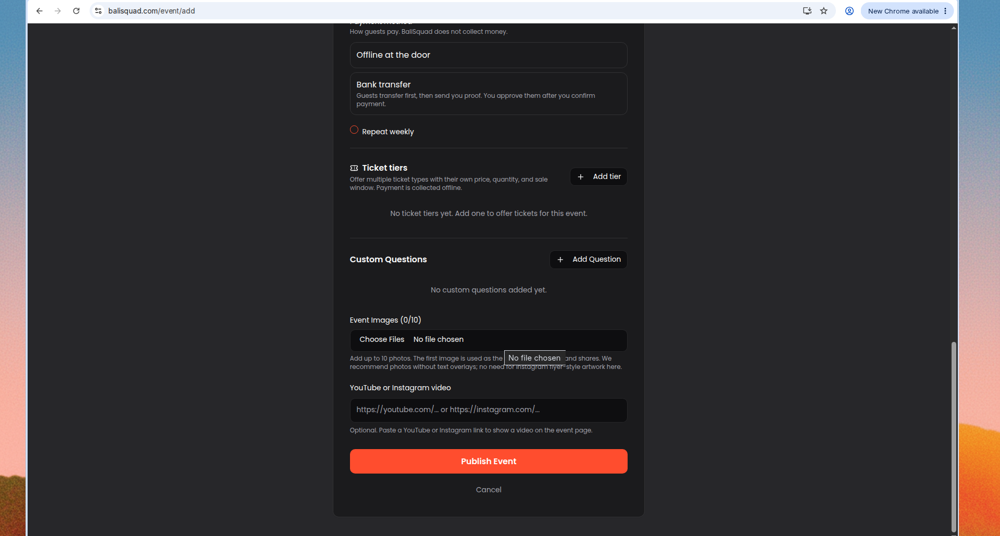

## How to Add an Event on BaliSquad

Got a meetup, dinner, game night, or workshop people should know about? Put it on [balisquad.com](https://balisquad.com). Public event pages reach folks outside your WhatsApp groups, and they don't disappear after 24 hours.

Here's the short path from blank form to published event.

---

### Before you start

Have these ready:

- A clear event title and short description
- Date and time in Bali time
- Venue or address (or mark it as online)
- Area (Canggu, Uluwatu, and so on)
- At least one cover photo (the first image becomes the card cover; prefer real photos without heavy text overlays)

You'll need a BaliSquad account. If you're new, sign up, then create your page (the profile you post as).

---

### 1. Sign in

Open [balisquad.com](https://balisquad.com) and sign in. Create an account if you don't have one yet.

---

### 2. Open Add Event

Go to [balisquad.com/event/add](https://balisquad.com/event/add). The FAQ answer for "Can I host my own event?" also links here.

---

### 3. Fill the basics

Required fields:

- **Event Title:** what's happening, plus a hint of the vibe
- **Posting as:** your page
- **Description:** time, place, what to bring, cost, and anything else people need before they RSVP (rich text is fine)

Optional: add co-hosts by searching pages by name.

---

### 4. When and where

Set the practical details:

- Toggle **This is an online event** if it isn't in person
- **Event Location** (venue or address search)
- **Area**
- **Expected Participants** if you want
- **Start Time** and optional **End Time** (Bali time)

Further down the form you'll also find categories, free/private/approval settings, payment method, repeat weekly, ticket tiers, and custom questions. Skip what you don't need for v1.

---

### 5. Media and publish

- **Event Images:** up to 10. The first image is the cover across cards and shares. Clear venue or activity photos work better than blurry Stories or flyer-style artwork with lots of text.
- Optional: paste a YouTube or Instagram video link for the event page.
- Hit **Publish Event**.

---

### Tips that help your listing get joins

- Lead with vibe in the title, not just the activity name
- Put time and area early in the description
- Add practical notes (bring shoes, entry fee, beginner friendly)
- Use photos people can trust: the room, the court, the table, the crowd

---

### Need help?

Message the squad from the homepage ("Want to host, help, or just say hi?"). We read every note.

Ready when you are: [Add an event](https://balisquad.com/event/add)
